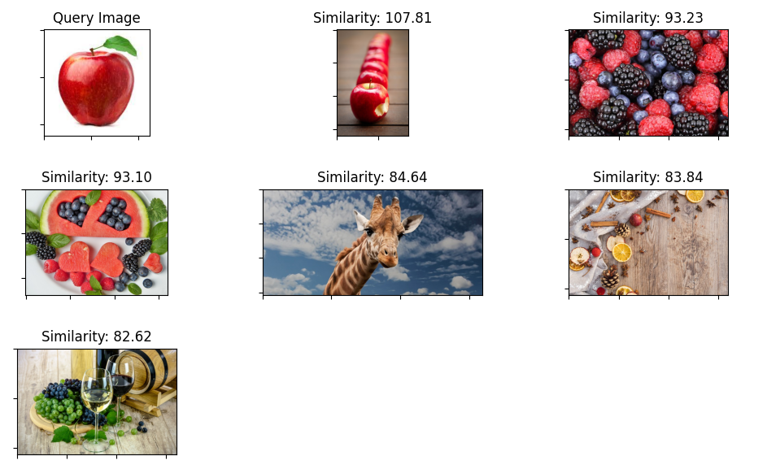
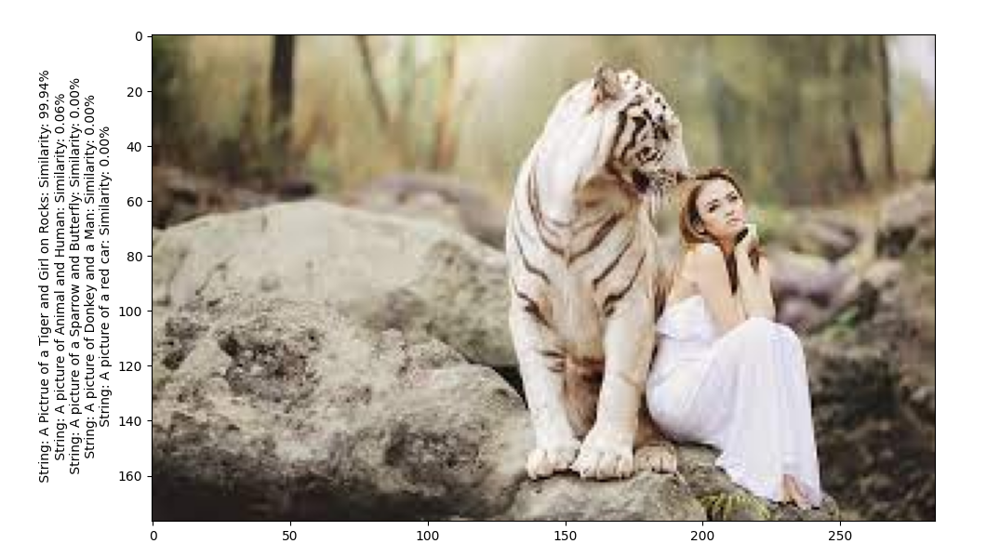
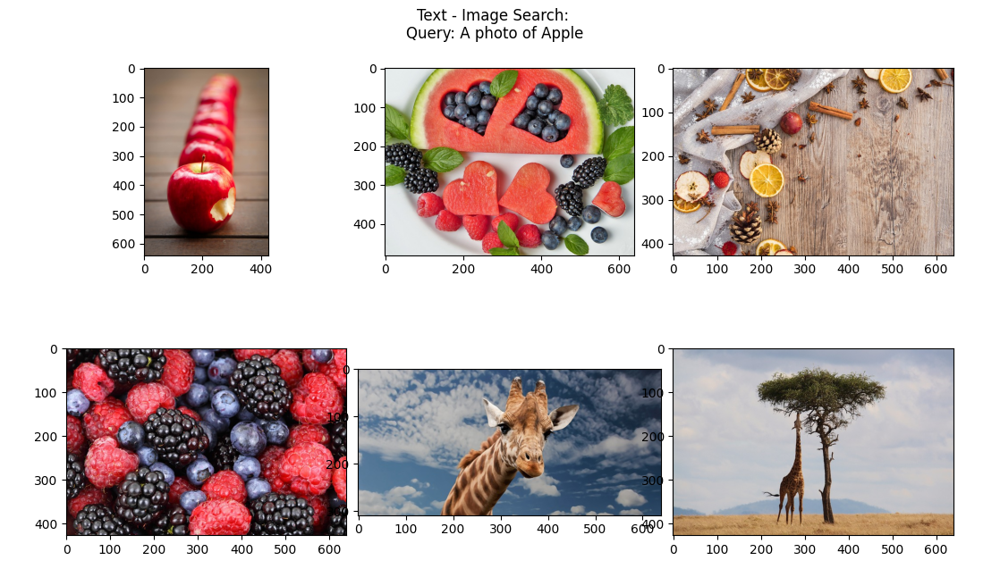

# Image Search Engines using CLIP
[CLIP](github.com/openai/clip) is a powerful Image Model that is trained under the supervision of Natural Language.

We Explore different Semantic Search Capabilities of CLIP.
1. Image - Image Search 
2. Text - Image Search
3. Image - Text Search
You can find a detailed writeup [here](https://medium.com/@ahmadanis5050/diving-into-clip-by-creating-semantic-image-search-engines-834c8149de56)

# Run the Repo
```bash
$ pip install -r requirements.txt
```

To run the Image-Image Search
```bash
$ python image_image_search.py
```
Results:



To run the Image-Text Search
```bash
$ python image_text_search.py
```
Results:



To run the Text-Image Search

```bash
$ python text_image_search.py
```
Results:

